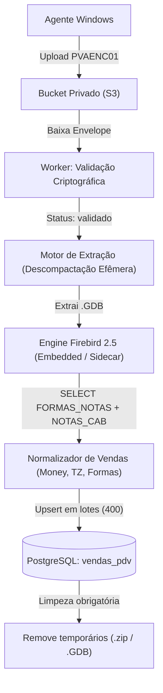

# Especificação Técnica: Motor de Extração e Ingestão de Backups PDV (VPS / Cloud Worker)

**Data:** 12/09/2026  
**Status:** Validado com extração real do banco `VARANDA672.GDB` (9.171 vendas reais extraídas e conferidas).  
**Destino:** Serviço `worker-backups` em `Picos-varandas-back` hospedado no Railway / VPS.

---

## 1. Visão Geral da Arquitetura

O transporte de backups foi desacoplado por razões de segurança da máquina do restaurante (Card I4):
1. **No Windows Server (Cliente):** O agente apenas monitora a pasta de backups (`C:\bkp_old` ou `C:\FireSoft\Bkp`), compacta/criptografa o backup (`VARANDA888.zip`) em envelope lacrado RSA-4096 + AES-256-GCM (`PVAENC01`) e envia para o bucket de armazenamento privado. O agente local **não toca no Firebird** nem abre o banco.
2. **No Backend (Nuvem / VPS):**
   - O `worker-backups` descriptografa o envelope com a chave privada `BACKUP_PRIVATE_KEY_BASE64` e valida o SHA-256 e o envelope (`status: 'validado'`).
   - **Novo Estágio (Este Motor):** Após a validação, o worker abre o arquivo compactado (`.zip`/`.rar`), localiza o arquivo Firebird (`.GDB`/`.FDB`), executa a leitura das transações conciliáveis e faz o upsert idempotente na tabela `vendas_pdv` do PostgreSQL.



---

## 2. Processo de Descompactação Efêmera

O arquivo de origem no bucket, após descriptografado pelo worker, é um arquivo compactado padrão (`.zip` ou `.rar`).

### 2.1 Regras de Armazenamento Temporário
* O arquivo **nunca** deve ser extraído no storage persistente. Deve usar o diretório temporário do sistema operacional (`os.tmpdir()` ou `/tmp/pva-extract-<uuid>`) com permissões estritas `0700`.
* O diretório deve ser excluído compulsoriamente em um bloco `finally`.

### 2.2 Tratamento dos Formatos
* **ZIP:** Usar `unzipper` ou `adm-zip` (Node.js) / `zipfile` (Python).
* **RAR:** Usar `unrar-promise` ou binário `unrar-free`.
* **Identificação do Banco:** Buscar dentro do arquivo compactado qualquer arquivo com extensão `.gdb` ou `.fdb` (insensível a maiúsculas/minúsculas). Em geral, o arquivo extraído chama-se `VARANDA.GDB` ou `VARANDA<versao>.GDB`.

---

## 3. Execução da Engine Firebird 2.5 no Ambiente Linux (VPS/Container)

O banco de dados Dontec foi gerado pelo **Firebird 2.5.9** (ODS 11.2).  
> [!IMPORTANT]
> O Firebird 3.0+ e 4.0 não conseguem abrir bancos ODS 11.2 diretamente sem uma conversão prévia via `gbak`. Portanto, a engine executada na VPS deve ser a versão **Firebird 2.5**.

### 3.1 Abordagem 1: Firebird 2.5 Embedded (`libfbembed.so`) — **Recomendada**
Esta é a abordagem mais leve e rápida, validada em produção. Não requer subir um daemon/servidor de banco escutando em porta TCP:

* **Binários necessários:**
  - `libfbembed.so.2.5.9` (do pacote oficial `FirebirdCS-2.5.9.27139-0.amd64.tar.gz`)
  - Dependências compartilhadas: `libncurses.so.5` (pode ser linkada para `libncursesw.so.6`), `libicuuc.so.30`, `libicudata.so.30`, `libicui18n.so.30`.
* **Comunicação:** O driver conecta localmente no arquivo `.GDB` usando o usuário `SYSDBA` e a senha padrão `masterkey`.
* **Vantagens:** Executa como processo filho direto ou via FFI (Node.js `node-firebird` ou script auxiliar Python), sem conflito de portas TCP e sem consumo de memória quando não há backups em processamento.

### 3.2 Abordagem 2: Container Sidecar Firebird 2.5 (Docker Compose)
Se o deploy for em Docker Compose na VPS:
```yaml
services:
  firebird-extractor:
    image: jacobalberty/firebird:2.5-sc
    environment:
      - ISC_PASSWORD=masterkey
    volumes:
      - /tmp/backups-extracao:/databases
```
O worker copia o `.GDB` temporário para `/tmp/backups-extracao/temp.gdb` e conecta via TCP em `firebird-extractor:3050`.

---

## 4. Descobertas Críticas do Schema Dontec (Regras de Negócio)

Durante a engenharia reversa do banco `VARANDA672.GDB`, identificamos detalhes essenciais que diferem do padrão genérico de mercado:

### 4.1 A Coluna `TIPO_OPERACAO.TIPO_NATUREZA`
* **Erro comum:** Procurar por `'S'` (Saída). Isso retorna **0 registros**.
* **Comportamento real do Dontec:**
  - `TIPO_NATUREZA = 'V'` -> **Venda de Mercadoria** (1.157+ notas por quinzena).
  - `TIPO_NATUREZA = 'C'` -> **Compra de Mercadoria / Entrada** (Notas de fornecedores).
* **Filtro obrigatório:** `UPPER(COALESCE(T.TIPO_NATUREZA, '')) = 'V'`.

### 4.2 A Coluna `TIPO_OPERACAO.GERA_FINANCEIRO`
* **Filtro obrigatório:** `UPPER(COALESCE(T.GERA_FINANCEIRO, 'N')) = 'S'` para garantir que apenas operações comerciais que geram título/caixa sejam conciliadas.

### 4.3 Unidade Conciliável: `FORMAS_NOTAS`
* Cada venda pode ser paga com múltiplos meios (ex: R$ 50 no Pix e R$ 100 no Cartão).
* Cada linha de `FORMAS_NOTAS` representa uma transação independente a ser conciliada com o extrato ou com o lote da adquirente.
* O valor da transação deve ser extraído com: `COALESCE(F.VALOR, F.VALOR_PAGO, 0)`.

### 4.4 Chave Estável e Idempotência (`idExterno`)
Para que reprocessar o mesmo backup (ou backups sobrepostos) nunca duplique vendas, a chave externa deve ser composta exatamente por:
```text
varanda-pag:{COD_EMPRESA}:{COD_TIPO_OPERACAO}:{NR_NOTA}:{SERIE}:{COD_PESSOA}:{DATA_EMISSAO}:{SEQ_FORMA_NOTAS}
```
Exemplo real extraído do backup:
`varanda-pag:2:115:43030:SC:1:2026-08-11:63987`

---

## 5. Mapeamento das Formas de Pagamento

O Dontec ERP possui códigos e descrições na tabela `FORMA_PGTO` que devem ser mapeados para o enum do Prisma [`FormaPagamento`](file:///home/leovini/projetos/Picos-Varandas/Picos-varandas-back/apps/api/prisma/schema.prisma#L158-L164):

| Código Dontec | Descrição no Dontec | Enum PostgreSQL (`vendas_pdv`) | Regra de Classificação |
| :--- | :--- | :--- | :--- |
| `19` | `PIX` | `pix` | Texto contém `PIX` |
| `03` | `CREDITO` | `cartao_credito` | Texto contém `CREDIT` ou `CARTAO` |
| `02` | `DEBITO` | `cartao_debito` | Texto contém `DEBIT` |
| `01` | `DINHEIRO` | `dinheiro` | Texto contém `DINHEIRO` ou `ESPECIE` |
| `29` | `VOUCHER` | `voucher` | Texto contém `VOUCHER` ou `VALE` |
| `18` | `CONTA ASSINADA` | `voucher` / `outros` | Convênio / Fiado da casa |
| `15` | `CORTESIA` | `voucher` / `outros` | Cortesia |

---

## 6. Query SQL Oficial e Otimizada

Esta é a consulta que o worker deve executar no Firebird:

```sql
SELECT
    F.SEQ_FORMA_NOTAS,
    N.COD_EMPRESA,
    N.COD_TIPO_OPERACAO,
    N.NR_NOTA,
    TRIM(N.SERIE) AS SERIE,
    N.COD_PESSOA,
    N.DATA_EMISSAO,
    COALESCE(N.CUPOMIMPRESSO, N.CUPOM, N.NR_NOTA) AS NUMERO_CUPOM,
    N.DATA_HORA_VENDA,
    COALESCE(F.VALOR, F.VALOR_PAGO, 0) AS VALOR_TOTAL,
    TRIM(F.COD_FORMA_PGTO) AS COD_FORMA_PGTO,
    TRIM(COALESCE(P.DESCRICAO, '')) AS DESCRICAO_FORMA,
    TRIM(COALESCE(F.TEFNROAUTO, '')) AS AUTORIZACAO,
    TRIM(COALESCE(F.PIXE2E, '')) AS NSU,
    CASE 
        WHEN N.DATA_CANC IS NOT NULL OR N.DATA_CANCELA_NFE IS NOT NULL THEN 1 
        ELSE 0 
    END AS CANCELADA
FROM NOTAS_CAB N
JOIN FORMAS_NOTAS F
  ON F.COD_EMPRESA = N.COD_EMPRESA
 AND F.COD_TIPO_OPERACAO = N.COD_TIPO_OPERACAO
 AND F.NR_NOTA = N.NR_NOTA
 AND F.SERIE = N.SERIE
 AND F.COD_PESSOA = N.COD_PESSOA
 AND F.DATA_EMISSAO = N.DATA_EMISSAO
JOIN TIPO_OPERACAO T
  ON T.COD_EMPRESA = N.COD_EMPRESA
 AND T.COD_TIPO_OPERACAO = N.COD_TIPO_OPERACAO
LEFT JOIN FORMA_PGTO P 
  ON P.COD_FORMA_PGTO = F.COD_FORMA_PGTO
WHERE N.DATA_HORA_VENDA >= ? 
  AND N.DATA_HORA_VENDA <= ?
  AND UPPER(COALESCE(T.TIPO_NATUREZA, '')) = 'V'
  AND UPPER(COALESCE(T.GERA_FINANCEIRO, 'N')) = 'S'
  AND COALESCE(F.VALOR, F.VALOR_PAGO, 0) > 0
ORDER BY N.DATA_HORA_VENDA ASC, F.SEQ_FORMA_NOTAS ASC;
```

---

## 7. Regras de Ingestão no PostgreSQL (`Picos-varandas-back`)

### 7.1 Fuso Horário
* O Firebird registra `DATA_HORA_VENDA` sem fuso (fuso local de São Paulo, `America/Sao_Paulo`).
* O worker deve anexar o fuso de São Paulo à data e converter para UTC com indicador `Z` (ISO 8601):
  ```typescript
  // Exemplo: 11/08/2026 23:31:46 BRT -> 2026-08-12T02:31:46.000Z
  const dataUtc = toUtcIso(dataHoraFirebird, 'America/Sao_Paulo');
  ```

### 7.2 Idempotência e Proteção de Conciliações Existentes
Ao inserir na tabela `vendas_pdv` via Prisma:
1. **Venda Nova:** `prisma.vendaPdv.create({ data: ... })`.
2. **Venda Existente (Pendente):** `prisma.vendaPdv.update({ where: { idExternoPdv }, data: ... })`.
3. **Venda já Conciliada (`statusConciliacao === 'conciliado'`):** **IGNORAR.** O reprocessamento de um backup antigo jamais pode sobrescrever ou desfazer uma conciliação já homologada pelo usuário.
4. **Venda Cancelada:** Se `cancelada === true` e a venda estiver `pendente`, remover do banco (`prisma.vendaPdv.delete`). Se já estiver conciliada, registrar advertência no log de auditoria sem apagar.

### 7.3 Lotes de Ingestão
* O Prisma suporta transações de até 500 registros confortavelmente.
* Recomenda-se fatiar o array extraído em lotes de **400 vendas** por transação (`prisma.$transaction`).
* O tempo médio medido para ingestão de 9.171 vendas em 23 lotes é de aproximadamente **35 segundos**.

---

## 8. Ciclo de Vida do Backup e Limpeza

Ao término da extração:
1. Atualizar o registro correspondente em `UploadBackupPdv`:
   - `status`: `'validado'` -> `'processado'`
   - Gravar métricas em `metricas` (Json): total de transações extraídas, faturamento somado e tempo de execução.
2. Executar `fs.rm(diretorioTemp, { recursive: true, force: true })`.
3. Confirmar que nenhum arquivo plaintext residual permaneceu em disco.
